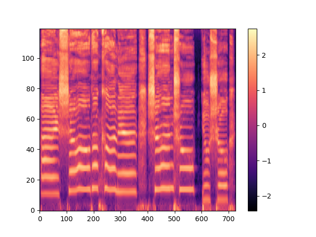
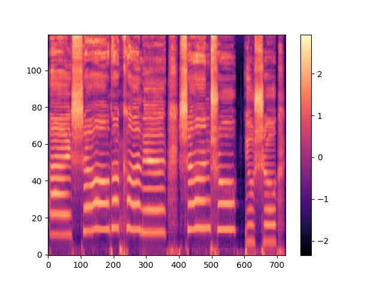
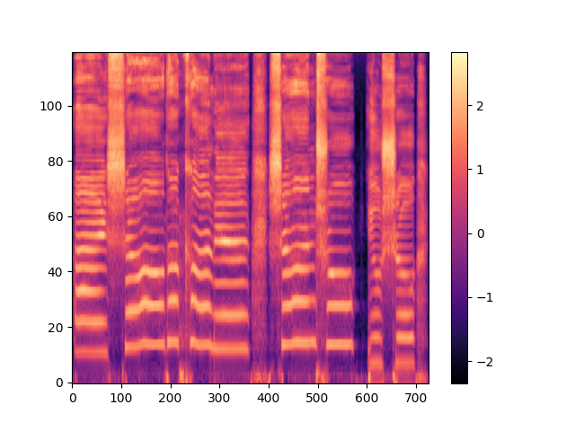
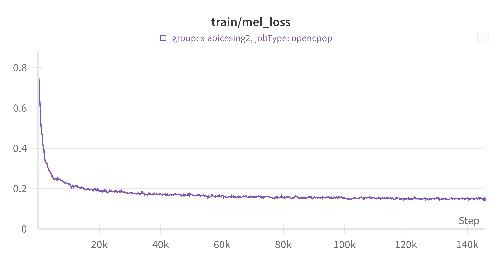
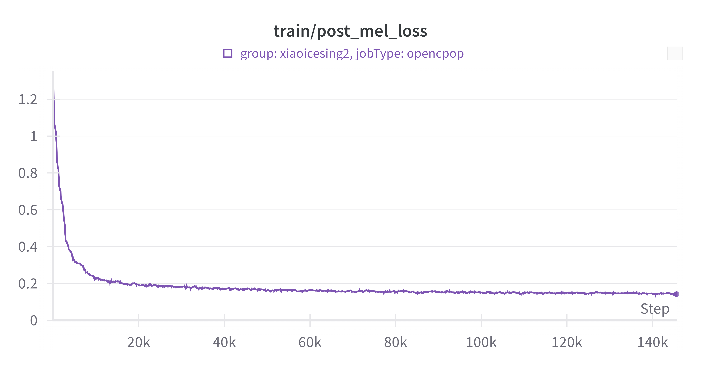

# [xiaoicesing2](https://www.isca-speech.org/archive/interspeech_2023/chunhui23_interspeech.html)
The source code for the paper [XiaoiceSing2](https://www.isca-speech.org/archive/interspeech_2023/chunhui23_interspeech.html) (interspeech2023)

## Implementation (developping)

- [x] fastspeech2-based generator
- [x] discriminator group, including segment discriminators and detail discriminators
- [ ] ConvFFT block

## Dataset and preparation

- [x] opencpop
- [ ] kiritan
- [ ] m4singer
- [ ] NUS48E

Kaldi style preparation

- wav.scp
- utt2spk
- spk2utt
- text

## Training

```
./run.sh --start-stage 2 --stop-stage 2
```

### Real and generated melspectrogram (145600 training steps)

Real(left) before post-processing(middle) after post-processing(right)

<div style="display:inline-block">
  
  
  
</div>

### L2 loss curve for melspectrogram

L2 loss before post-processing(left) L2 loss after post-processing(right)

<div style="display:inline-block">
  
  
</div>

## Inference

```
./run.sh --start-stage 3 --stop-stage 3
```
